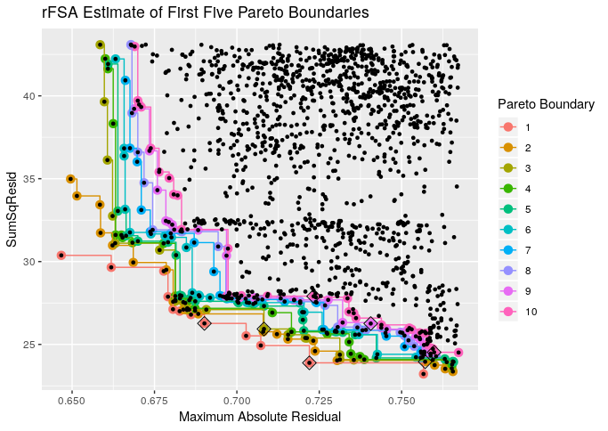
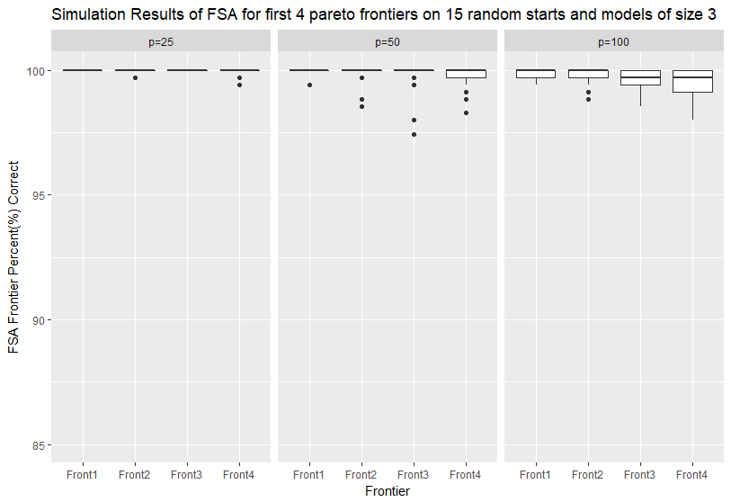
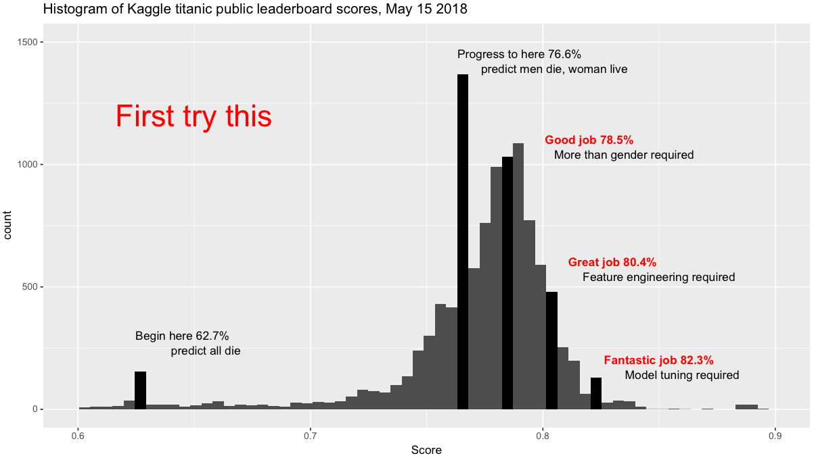
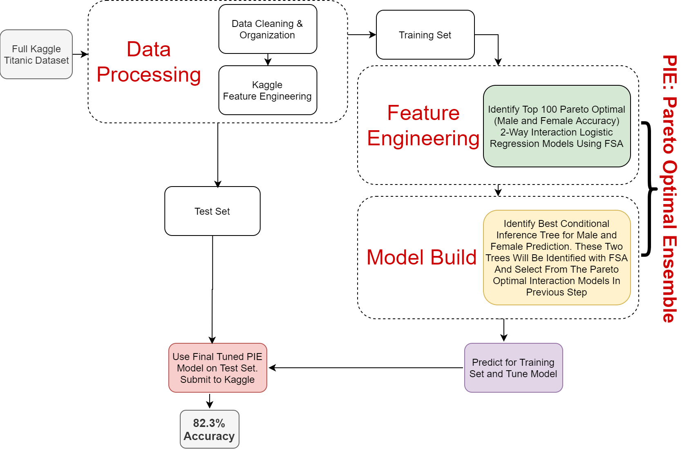
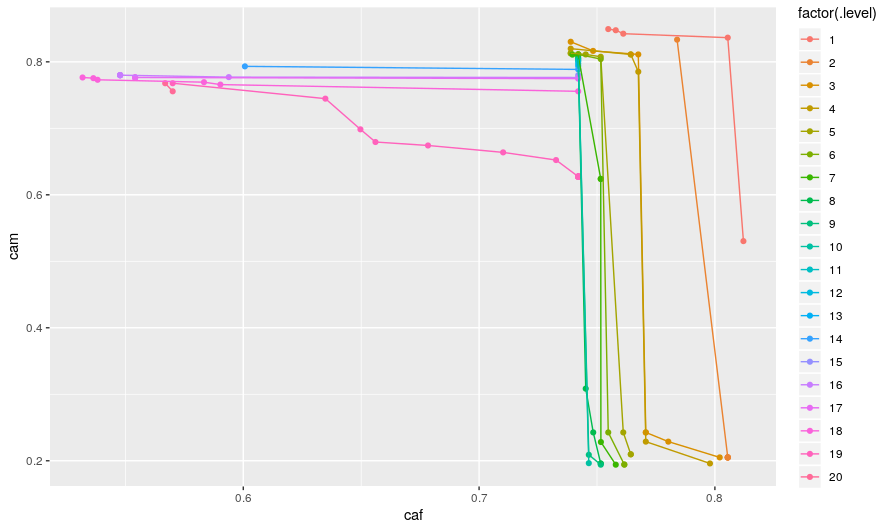

# Hello!
* Assistant Professor and Biostatistician
    + Within a College of Nursing
* I teach PhD students in Nursing Research
    + Little background in math or stats
* I consult with Facutly, Students and Staff  within CoN
    + I'll discuss more later
* I conduct my own research in statistical methodology
    + Contents of this talk

# Previous Research
{width=150px}

* The Feasible Solution Algorithm (FSA) (Dissertation December 2017)
* R package rFSA (released in Jan 2018)
* rFSA R Journal Paper (Published December 2018)

# Current Research: Big Data in Health Outcomes

* Working on problems in big data for health outcomes
* PI NIH R03 and R21 submissions to NIDA, NINR, and NICHD (currently under review)
* Applying FSA to identify subgroup specific effects in big data. These include
  + Maternal Morbidity (CSL data)
  + Outcomes of Children Prenatally Exposed to Opioids (MIDH data)
  + Telomere Length (CARDIA data)

# Current Research: Biostatistics Methodology \Laughey
* Improving the FSA
* Using FSA for estimating pareto optimal regression models
* Pareto Interaction Ensemble (PIE) Machine \Coffeecup

# The Feasible Solution Algorithm
* First introduced by Dr. Doug Hawkins (University of Minnesota) in 1993 paper "The feasible set algorithm for least median of squares regression". 
* In 2015, Dr. Arnold Stromberg and I developed the current implementation of the algorithm for subset selection and interaction identification. The R package $rFSA$ implements our algorithm in R.
* For m=2
* (Form 1) Subsets: $Y\sim\beta_0+\beta_1X_A+\beta_2X_B$
* (Form 2) Interactions: $Y\sim\beta_0+\beta_1X_A+\beta_2X_B+\beta_3X_AX_B$

# The Feasible Solution Algorithm
1. Randomly select $m$ variables to compose either Form 1 or Form 2, and compute the objective function of choice.
2.	Under each possible exchange of one of the $m$ variables in the working model for a variable not contained in the model, compute the new value of the objective function.
3. Make the single exchange of variables from Step 2 that most improves the objective function.
4. Continue making exchanges until no single additional exchange improves the objective function.  The variables composing the final model constitute a single feasible solution.
5. Return to (1) to search for another feasible solution. 	

# The Feasible Solution Algorithm
* How does it do?
* See Lambert rFSA R Journal paper 2018 (9000 downloads)
  + Fast, Flexible, >> Interactions
* Featured in Kuhn and Johnson's 2019 book "Feature Engineering and Selection: A Practical Approach for Predictive Models"
* Properties of FSA in 2019 book "Modern Statistical Methods for Spatial and Multivariate Data" Dr. Norou Diawara
  + "Properties of the Number of Iterations of a Feasible Solutions Algorithm" by Janse and Thompson 2019
  + Determine the number of iterations of FSA needed to obtain the statistically optimal solution of an m-way interaction model with a certain probability (lower bound)
  + A lower bound on the probability of identifying optimal model in $cp$ random starts is $1-e^{-cm^2}$ where $0<c<1$.


# Pareto Optimality
* During the process of model selection statisticians are often concerned with the model which has the single most optimal criterion (eg. AIC, $R^2$) before continuing to check several other diagnostics. 
* This strategy is multi-objective in nature but single-objective in its numeric execution. 
* Jin and Sendhoff, 2008 "Pareto-Based Multiobjective Machine Learning: An Overview and Case Studies"

# Pareto Optimality: A Picture
{width=10cm}
# Pareto Optimality
* A solution $X$ is called Pareto-optimal if the solutions criteria ($f_1,f_2,\dots,f_m)$ are not completely dominated by any other solution's criteria 
* Many Pareto-optimal solutions typically exist when considering $\ge2$ criterion at a time.
* The set of Pareto-optimal solutions for a given problem are called the Pareto front.
* If this $1^{st}$ Pareto frontier is removed, then next set of Pareto-optimal solutions is called the $2^{nd}$ Pareto frontier.

# Pareto Optimality: Great, but isn't this hard to estimate?
* Yes! Obtaining the the set of Pareto-optimal solutions and the frontiers is increasingly difficult as the number of solutions and criterion grow.
* Exhastively searching will be difficult. For $p$ variables, $c$ criteria, identifying subsets of size $m$ would require $choose(p,m)$ model checks and $choose(p,m)*c$ criteria checks.
* Sinha et. al. in  "A Multiobjective Exploratory Procedure for Regression Model Selection" suggest a proceedure when the criteria are subset size, and one other model fit criteria ($AIC$, $R^2$).
  + not flexible


# FSA and Pareto Optimality
* Given that FSA can identify *feasible solutions*, could we use it to estimate the pareto frontiers while remaining flexible to the criteria and regression strategy?
* Idea of FSA for Pareto Optimality:
  + Start with $1 \dots c$ criteia
  + Use FSA to store models considered along the way to feasible solutions for criterion 1
  + Repeate this until completed for all $c$ criteria.
  + At the end you will have a list of models considered by FSA along the path to the feasible solutions for criterion $1,\dots, c$.
  + Calculate all criteria for all models considered.
  + Use this list as our estimate for Pareto Frontiers

# FSA and Pareto Optimality
* How does this do? Under review at International Journal of Data Science and Analytics


{width=7cm}

# Ensemble Learning
* Can we select a set of predictive models so that their "stacked"" performance is better then what we could have gotten from the single best model?
* We would like to be able to select a variety of models for our ensemble which predict different subsets of the data. Are the models predictions uncorrelated?
* When the uncorrelated models' predictions are put together via a "Stacking" algorithm to predict the response will we get a good predictor?


# Do you want to build an ensemble \Snowman?
* Can we use FSA to identify pareto optimal solutions along with a simple stacking algorithm to predict? Could it:
    + Compete with other machine learning techniques (RF, SVM, GBM, NN)?
    + Maintain high accuracy accross 2 or more criteria? 
    + Interpretable?

# Pareto Interaction Ensemble (PIE) Machine \pan
{width=250px}

# Concept of PIE Machine \rollingpin
* FSA can identify interactions
* FSA can also estimate interactions which are pareto optimal
* Can we use FSA to select a finite set of simple 2-way interaction models that predict different aspects of an outcome?
    + $Y\sim\beta_0+\beta_1X_1+\beta_2X_2+\beta_3X_1X_2$
* Then use a classification and regresison tree to combine these predictions in an interpeatble way? \BasicTree[2]{blue!65!white}{cyan!50!white}{cyan!50!white}{}
* Where will we find a dataset to predict with and a community of data scientist to compete with?


<!-- # Some math -->
<!-- * Identify pareto optimal models of the form: -->
<!--     + $Y\sim\beta_0+\beta_1X_1+\beta_2X_2+\beta_3X_1X_2$ -->
<!-- * Then recursively perform splits of the dependent variable based on values on a set of predictions from   -->
# Kaggle! Kaggle is a place to ... 

* learn, challenge, and improve data science, statistics, and computer science skillz. 
* access numerous:
    + datasets
    + code
    + data scientists
* get answers
* drum up new ideas
* make money (??) \Ninja

# Kaggle: Titanic Challenge


* Your score is the percentage of passengers you correctly predict (Surivived, or Deceased). 
* Challenge offers nice sandbox for testing new ML algorithms.

# Kaggle: Cheaters of Titanic Proportions


# Motivation of a New ML Approach and Titanic Data
* RF model (ranger package in R) with 500 trees for Titanic Data
    + Training accuracy is 78.9% for Females
    + Training Accuracy is 83.7% for Males
* We would prefer a model that predicts well for both Females and Males. 
* Also, it is difficult to tease out exactly why it is making this mistake.
* Real World Example: Recently Reuters reported that Amazon has been trying to develop a tool to automate resume screening and hiring. The project had to be scrapped because it showed a heavy prejudice against women. [cite](https://www.reuters.com/article/us-amazon-com-jobs-automation-insight/amazon-scraps-secret-ai-recruiting-tool-that-showed-bias-against-women-idUSKCN1MK08G)

# Summary of PIE strategy for Titanic
* Predict Survival
* Want: model accurate predictions for males and females (pareto optimal)
* Use FSA  to identify interactions which are estaimted to be pareto optimal
* Use FSA to select a finite (\# of models < 5) set of which when used in a tree predict the response well in the training set. (We will call this PIE machine)
* Apply test set to PIE machine and submit findings to Kaggle. Hope it competes with other machine learning methods.


# PIE & Kaggle Workflow


# PIE in R with rFSA: Setup

Kudos to @reisel [https://www.kaggle.com/reisel/imputation-and-feature-engineering/data](https://www.kaggle.com/reisel/imputation-and-feature-engineering/data) for the feature engineering and data cleaning. Please see their kaggle RMD at the link for more info on how they engineered the dataset.


# PIE in R with rFSA: Setup Code
```{r options, echo=FALSE}
knitr::asis_output("\\tiny")
```

```{r setup, include=TRUE, eval=FALSE}
passenger<-read.csv("data/passenger.csv")

#assigning categorical variables as factors
passenger$Survived<-as.factor(passenger$Survived)
passenger$Pclass<-as.factor(passenger$Pclass)
passenger$SpouseSurvivedDiff<-as.factor(passenger$SpouseSurvivedDiff)
passenger$SiblingSurvivedDiff<-as.factor(passenger$SiblingSurvivedDiff)
passenger$ChildrenSurvivedDiff<-as.factor(passenger$ChildrenSurvivedDiff)
passenger$ParentsSurvivedDiff<-as.factor(passenger$ParentsSurvivedDiff)
passenger$FatherSurvivedDiff<-as.factor(passenger$FatherSurvivedDiff)
passenger$MotherSurvivedDiff<-as.factor(passenger$MotherSurvivedDiff)
passenger$RelativesSurvivedDiff<-as.factor(passenger$RelativesSurvivedDiff)
passenger$SameTicketNumber<-as.factor(passenger$SameTicketNumber)
passenger$HasAge<-as.factor(passenger$HasAge)
passenger$HasCabin<-as.factor(passenger$HasCabin)
passenger$Deck<-as.factor(passenger$Deck)
passenger$CabinSide<-as.factor(passenger$CabinSide)

#There aren't many Dr or Rev, so lets set them to RareTitle and refactor
passenger$Title[which(passenger$Title=="Dr")]<-"RareTitle"
passenger$Title[which(passenger$Title=="Rev")]<-"RareTitle"
passenger$Title<-factor(passenger$Title)

train<-passenger[passenger$DataSet=="Training",-1]
test<-passenger[passenger$DataSet=="Test",-1]
```

# PIE in R with rFSA: Overview of Variables
```{r options2, echo=FALSE}
knitr::asis_output("\\tiny")
```

```{r setup2, include=TRUE, eval=FALSE}
#variables we'd like to use for predictions (note: this doesn't include all variables available)
vars<-c("Survived","Pclass","Sex","Age","SibSp",
        "Parch","Fare","Embarked","Title",
        "SpouseNumber","SpouseSurvivedDiff",
        "SiblingNumber","SiblingSurvivedDiff",
        "ChildrenNumber","ParentsNumber",
        "ChildrenSurvivedDiff","ParentsSurvivedDiff",
        "FatherSurvivedDiff","FatherNumber",
        "MotherSurvivedDiff","MotherNumber",
        "RelativesSurvivedDiff","SameTicketNumber",
        "FamilySize","FarePerPerson","HasAge",
        "HasCabin","Deck","CabinSide"
        #,"SiblingAgeMin","SiblingAgeMax","SiblingAgeMean",
        #"ParentAgeMin","ParentAgeMax","ParentAgeMean",
        #"ChildrenAgeMin","ChildrenAgeMax","ChildrenAgeMean",
        #"SameTicketAgeMin","SameTicketAgeMax","SameTicketAgeMean","SpouseAge"
        )
```

# PIE in R with rFSA: Required Libraries
```{r, include=TRUE, eval=FALSE}
library(rFSA)
library(ggplot2)
library(rPref)
library(partykit)
```


# PIE in R with rFSA: FSA code
```{r options3, echo=FALSE}
knitr::asis_output("\\tiny")
```

```{r, include=TRUE, eval=FALSE}
caf<-function(model){
  if(!typeof(model)=="list"|any(is.na(model$coefficients))){return(0)}
  tab<-table(factor(round(as.numeric(predict(model,type="response",newdata = train)>0.35)),levels = c(0,1)),train$Survived,train$Sex)
  sum(diag(tab[,,"female"]))/sum(tab[,,"female"])
}

cam<-function(model){
  if(!typeof(model)=="list"|any(is.na(model$coefficients))){return(0)}
  tab<-table(factor(round(as.numeric(predict(model,type="response",newdata = train)>0.35)),levels = c(0,1)),train$Survived,train$Sex)
  
  sum(diag(tab[,,"male"]))/sum(tab[,,"male"])
}

start<-Sys.time()
sln <- pFSA(formula =  "Survived~1", data = train[,vars], m = 2,fitfunc = glm, family="binomial", criterion = c(caf,cam), minmax = c("max","max"),numrs = 40,numFronts = 5,interactions = TRUE,cores = 40,pselExpr =rPref::high(caf)*rPref::high(cam), plot.it = FALSE)
end<-Sys.time()
end-start
```

# PIE in R with rFSA: make predictions using pareto models

* Left out some code here. Check github if you are interested in the code to do this. 
* Select top 100 models that are pareto optimal. Turns out to estimated the first approx 20 pareto boundaries.

# PIE in R with rFSA: ploting the estimates of the pareto boundary


<!-- # PIE in R with rFSA: gather information -->
<!-- ```{r, include=FALSE, eval=FALSE} -->
<!-- sln2<-sln$fits[-which(sln$fits$caf==0|sln$fits$cam==0),] -->
<!-- pbound<-psel(df = sln2,pref = rPref::high(caf)*rPref::high(cam),top=100) -->
<!-- ggplot(data = pbound,aes(x=caf,y=cam,color=factor(.level)))+ geom_point()+geom_line() -->

<!-- pos2key <- function(pos) { paste(pos,collapse = ",")} -->
<!-- key2pos <- function(key) { eval(parse(text=paste0("c(", key, ")")))} -->

<!-- pred_mat<-NULL -->
<!-- for(i in 1:dim(pbound)[1]){ -->
<!--     form<-as.formula(paste("Survived~",paste(colnames(train[,vars])[key2pos(pbound[i,1])],collapse = "*")))  -->
<!--     fit<-glm(form,data=train[,vars],family = "binomial") -->
<!--     preds<-predict(fit,newdata=train[,vars],type="response") -->
<!--     pred_mat<-cbind(pred_mat,preds) -->
<!-- } -->

<!-- pred_mat<-data.frame(pred_mat) -->
<!-- cname<-NULL -->
<!-- for(i in 1:dim(pbound)[1]){ -->
<!--   cname<-c(cname,pos2key(colnames(train[,vars][key2pos(pbound$Key[i])]))) -->
<!-- } -->

<!-- colnames(pred_mat)<-gsub(pattern = "\\,",replacement = "_",x = cname) -->

<!-- pred_mat$Survived<-train$Survived -->
<!-- ``` -->

<!-- #make preditive matrix -->
<!-- ```{r, include=FALSE, eval=FALSE} -->
<!-- pred_mat_test<-NULL -->
<!-- for(i in 1:dim(pbound)[1]){ -->
<!--     form<-as.formula(paste("Survived~",paste(colnames(train[,vars])[key2pos(pbound[i,1])],collapse = "*")))  -->
<!--     fit<-glm(form,data=train[,vars],family = "binomial") -->
<!--     preds<-predict(fit,newdata=test[,vars],type="response") -->
<!--     pred_mat_test<-cbind(pred_mat_test,preds) -->
<!-- } -->

<!-- #pred_mat_test[is.na(pred_mat_test)]<-runif(n=sum(is.na(pred_mat_test)),0,1) -->
<!-- pred_mat_test<-data.frame(pred_mat_test) -->
<!-- cname<-NULL -->
<!-- for(i in 1:dim(pbound)[1]){ -->
<!--   cname<-c(cname,pos2key(colnames(train[,vars][key2pos(pbound$Key[i])]))) -->
<!-- } -->

<!-- colnames(pred_mat_test)<-gsub(pattern = "\\,",replacement = "_",x = cname) -->
<!-- ``` -->

# PIE in R with rFSA: Putting it together CART
```{r options4, echo=FALSE}
knitr::asis_output("\\tiny")
```

```{r, include=TRUE, eval=FALSE}
cam.tree<-function(tree){
  if(is.null(tree)){return(0)}
  tab<-table(predict(tree,type="response"),train[,"Survived"], train[,"Sex"])
  sum(diag(tab[,,"male"]))/sum(tab[,,"male"])
}

caf.tree<-function(tree){
  if(is.null(tree)){return(0)}
  tab<-table(predict(tree,type="response"),train[,"Survived"], train[,"Sex"])
  sum(diag(tab[,,"female"]))/sum(tab[,,"female"])
}

ctree2<-function(formula,data){
  ctree(formula,data,control = ctree_control(minsplit = 10, minbucket = 5, maxdepth = 4))
}

tree_fsa_2way<-FSA(formula = Survived~.,data = pred_mat,fitfunc = ctree2,
              fixvar = NULL, quad = FALSE,
              m = 3, numrs = 40, cores = 40, interactions = FALSE, 
              criterion = c(caf.tree, cam.tree), minmax = c('max', 'max'),checkfeas = NULL,var4int = NULL
              )

tree_fsa_2way$table[which.max(tree_fsa_2way$table$criterion.1),]$formula #female
tree_fsa_2way$table[which.max(tree_fsa_2way$table$criterion.2),]$formula #male

tree.male<-ctree(formula = Survived~SibSp_Title+Embarked_Title+Age_CabinSide,data = pred_mat,control = ctree_control(minsplit = 10, minbucket =5 , maxdepth = 4))
tree.female<-ctree(formula = Survived~Age_Title+Sex_FarePerPerson+Pclass_Fare,data=pred_mat,control = ctree_control(minsplit = 10, minbucket = 5, maxdepth = 4))
cam.tree(tree.male)
caf.tree(tree.female)
```


#  PIE in R with rFSA: make predictions
```{r options5, echo=FALSE}
knitr::asis_output("\\tiny")
```

```{r, include=TRUE, eval=FALSE}
pred_mat_test$Sex<-test$Sex
male_pred<-predict(object = tree.male, type="response", newdata=pred_mat_test[pred_mat_test$Sex=="male",])

female_pred<-predict(object = tree.female, type="response", newdata=pred_mat_test[pred_mat_test$Sex=="female",])
table(male_pred)
table(female_pred)

pred_mat_test$pred<-NA
pred_mat_test[pred_mat_test$Sex=="male",]$pred<-male_pred
pred_mat_test[pred_mat_test$Sex=="female",]$pred<-female_pred
pred_mat_test$pred<-pred_mat_test$pred-1
table(pred_mat_test$pred,pred_mat_test$Sex)
      

pie_results<-cbind(test$PassengerId,pred_mat_test$pred)
colnames(pie_results)<-c("PassengerId","Survived")
table(pie_results[,2])
write.csv(pie_results,file = "PIEmachineMaleFemale.csv",row.names = FALSE)
```

#  PIE in R with rFSA: Upload to Kaggle
{width=400px}


# PIE in R with rFSA: Shiny App for Titanic Example

* App code is on Github page. Need *library(shiny)* to run.
* [Run App Now!](http://modeling.nursing.uc.edu/PIE/)

# Summary

* Used FSA to find models with 2-way interactions.
* Used FSA to estimate the parto boundaries for models that have high female and male accuracy.
* Used FSA to pick the best 3 models to use in a CART model for final ensemble prediction.
* We called all this PIE. Why would we want to use PIE?
  + Have a model which performs well on mulitple critiera
  + Interpretable model
  + Similar performance to other ML results on Kaggle. Top 4%.
  
* This is in pre-alpha stages. So user beware on other datasets.
* Working on paper now, should be submitted soon(ish).
  

# Thank you!

* [https://github.com/joshuawlambert/PIEtalk](https://github.com/joshuawlambert/PIEtalk)
* Remember: "All models are wrong, but some are useful -Dr. George Box".


